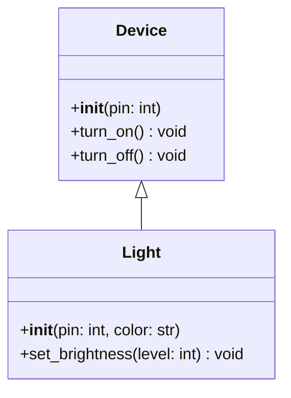

# Class Diagram Creator Skill

This skill provides guidelines and procedures for extracting class structures and generating Mermaid class diagrams for classes in the PicoLibrary project.

## 1. Class Extraction Process

When creating a class diagram, perform the following steps to gather necessary details:

### A. Identifying Superclasses (Inheritance)
- **Source**: Look at the class declaration line: `class ChildClass(ParentClass1, ParentClass2):`.
- **Filtering**: Include only parent classes that are part of the PicoLibrary project (typically matching filenames in the repository starting with an uppercase letter).
- **Exclusion**: Ignore external/system bases (e.g., standard Python libraries or MicroPython-specific modules like `machine`, `framebuf`, etc.).
- **Mermaid Syntax**: Represent inheritance using `<|--` (e.g., `ParentClass <|-- ChildClass`).

### B. Identifying Attributes
- **Class Attributes**: Variables defined directly inside the class block (e.g., `constants`). Exclude private class attributes (prefixed with `_`).
- **Instance Attributes**: Look inside the `__init__` constructor for assignments to `self` (e.g., `self.pin = pin`).
- **Filtering**: Focus on public attributes (do not start with `_`).
- **Formatting**: Format attributes in Mermaid as `+name : type` (e.g., `+pin : int`).

### C. Identifying Methods
- **Constructor**: Include `__init__`.
- **Public Methods**: Include any functions defined within the class body that do not start with `_`.
- **Exclusion**: Exclude all private helper methods starting with `_` (except `__init__`).
- **Formatting**: Format methods in Mermaid as `+method_name(param1: type) : return_type`.

### D. Identifying Associations & Relationships
- **Association (`-->`)**: A class holds a reference to another class (e.g., as a field/attribute).
- **Composition (`*--`)**: A class owns and manages the lifecycle of another class (e.g., creating the sub-component inside its constructor).
- **Aggregation (`o--`)**: A class uses another class instance passed into it (e.g., passed as a dependency in the constructor).
- **Dependency (`..>`)**: A class temporarily references another class (e.g., as a parameter in a method call other than the constructor).

---

## 2. Mermaid Diagram Layout & Syntax Guidelines

Generate the diagram inside a `mermaid` code block using `classDiagram` notation.

### Formatting Rules
1. **Visibility**: Use `+` for public members and `-` for private/protected members (typically, only include public ones and `__init__` unless private ones are critical to explain structural mechanics).
2. **Relationships**:
   - Inheritance: `Parent <|-- Child`
   - Composition (strong ownership): `Owner *-- Owned`
   - Aggregation (uses/references): `Whole o-- Part`
   - Association: `ClassA --> ClassB`
3. **Clutter Control**: If a class has too many attributes/methods, limit list to the top 5-7 most relevant public members.
4. **Sizing**: Design the diagram structure so that it fits cleanly on an 8.5x11 inch page or a single presentation slide without overlapping paths.

### Example Template

